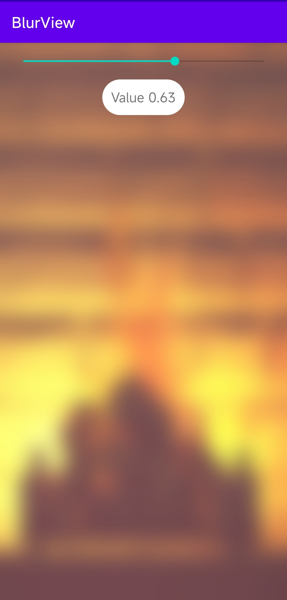

# BlurView

My own project, where there are tests of blur and Seek bar settings, this application was created for the purpose of my education, and is posted here so that you too can understand how it woking  

With love, @Android_xDev  
https://t.me/android_xdev  
created in the app Code Assist  

-------

### install :
1. Download BlurView.zip
2. Unzip the archive BlurView.zip
3. run project via code asset
    

### Screenshot:  

